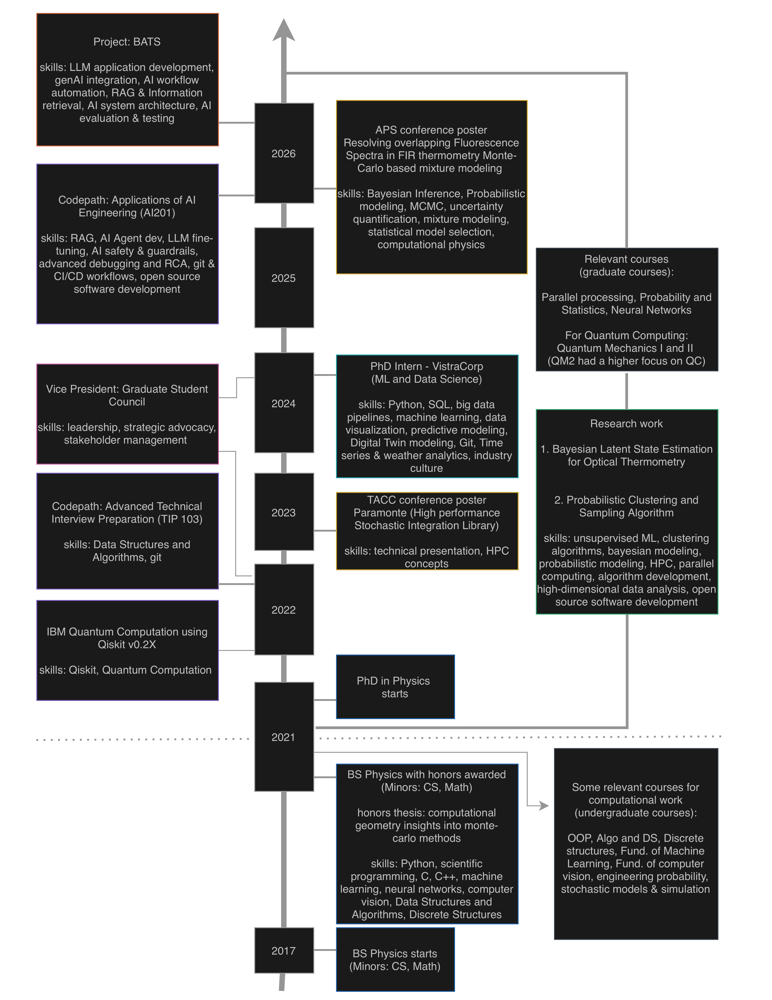

# Hi, I'm Nabin Chapagain
 
**Computational Physicist · PhD candidate · builder of probabilistic algorithms**
 
> A physicist who likes to program — chasing "why" questions with Bayesian statistics, scientific computing, and the occasional quantum circuit.
 
I've been curious about how things work for as long as I can remember, and I fell for programming in middle school — that rush after a solved problem never got old. I feel lucky to work in an era where I don't have to pick just *one* of the things I love. So I do computational physics: building statistical algorithms and pointing them at hard scientific questions.

## This timeline tells the story of where I am right now. 
Please feel free to reach out if you find anything below interesting and would love to chat about it.

 
## What I'm working on
 
- **Research focus:** probabilistic and Bayesian methods — MCMC, uncertainty quantification, latent-state estimation, and unsupervised clustering — applied to problems like optical thermometry.
- unsupervised clustering algorithms that use Bayesian Statistics to determine the clusters probabilistically.
- Increasingly working at the intersection of **physics, machine learning, and AI engineering** (RAG, LLM application development, evaluation).
- Long-standing interest in **quantum computing** (IBM Qiskit certified).

## Featured projects
 
### [BATS — AI Resume Builder](https://github.com/theoneineed/ai_resume_builder)
Python pipeline (Gemini API + RAG) that tailors a résumé to a job posting through a validated JSON contract — so the model never invents employers, dates, or metrics — and outputs an ATS-friendly PDF plus a keyword-gap report.
 
### [FIR Thermometry](https://github.com/theoneineed/firThermometry/tree/main)
Code pipeline developed to analyze the intensity data collected using FLS1000 spectrophotometer. The designed pipeline is useful for steps from reading the file to performing FIR analysis for the specific dataset.
 
### [Machine Learning & Computer Vision](https://github.com/theoneineed/MLandVision)
Coursework projects spanning two semesters — classical ML and computer-vision pipelines built from the ground up.
 

<!-- 
#### Features:
- [Feature 1]
- [Feature 2]
- [Feature 3]

#### Technologies Used:
- [Technology 1]
- [Technology 2]
- [Technology 3]

#### Results:
[Summary of the results achieved in the project, including any metrics or evaluations.]

#### Demo:
[If applicable, provide a link to a demo or live version of the project.]

Repeat this further for more repositories
-->

## Contact Me
- LinkedIn: [Nabin Chapagain](https://www.linkedin.com/in/theoneineed/)
- Email: [nabin.chapagain@mavs.uta.edu](mailto:nabin.chapagain@mavs.uta.edu)
- Personal Website: [My Website](https://www.nabinchapagain.com.np)
- Google Scholar: [Nabin Chapagain](https://scholar.google.com/citations?hl=en&user=53uRklAAAAAJ)
